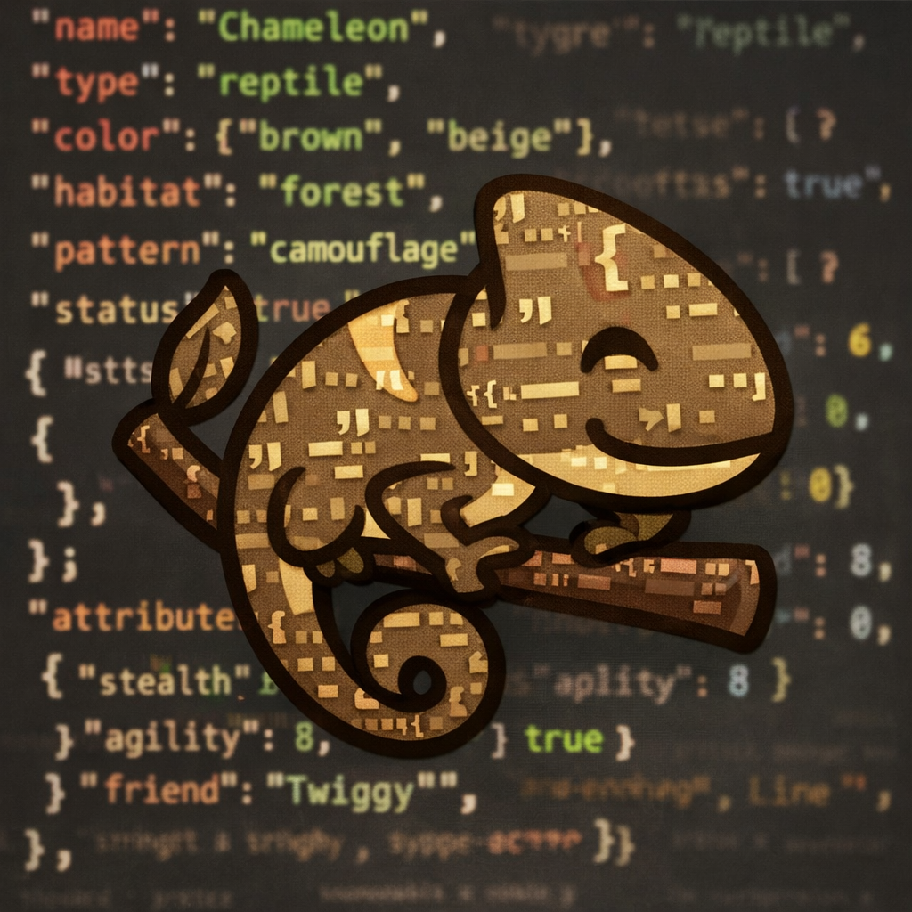

# Chameleon

Open-source mock/faker server — generate realistic API responses from your existing schemas, with one-click deploy to Vercel.

**[Full documentation on the wiki →](https://github.com/EmanueleMinotto/chameleon/wiki)**

---

## License

[MIT](LICENSE) © Emanuele Minotto
